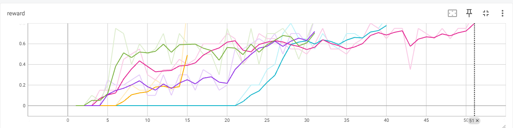
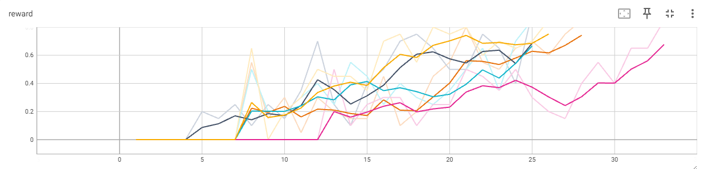
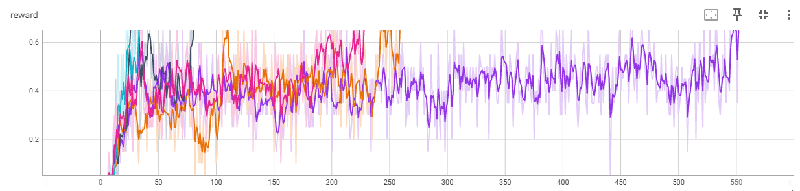
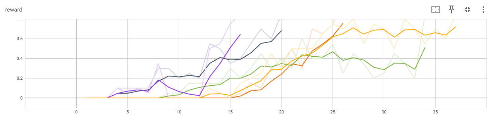
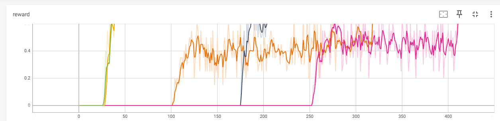
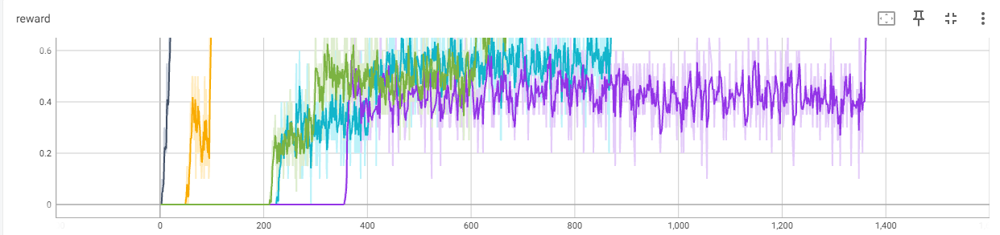

# Отчет 2. Исследование метода Q-learning в среде Frozen Lake 

## 1. Сравнение алгоритмов V и Q learning (2 балла)
Для алгоритма `V learning` на поле (4х4) при `gamma=0.9` сходимость (mean reward > 0.85) достигается в среднем за 33 итерации (от 15 до 51). 
Графики зависимости reward от количества итераций приведены ниже. 

Для алгоритма `Q learning` на поле (4х4) при `gamma=0.9` сходимость (mean reward > 0.85) достигается в среднем за 29 итерации (от 25 до 33). 
Графики зависимости reward от количества итераций приведены ниже. 

**Вывод:** Алгоритм обучения ценности действий более эффективен чем обучение ценности состояний. Это связано с тем, что алгоритм `Q learning` для обновления текущей стратегии использует опыт, накопленный приреализации разных стратегий.

## 2. Влияние гиперпараметра `GAMMA` на скорость сходимости . (2 балла)

Для алгоритма `Q learning` на поле (4х4) при `gamma=0.8` сходимость (mean reward > 0.85) достигается в среднем за 293 итерации (от 34 до 552). 
Графики зависимости reward от количества итераций приведены ниже. 

Уменьшение гиперпараметра `GAMMA` приводит к увеличению количества итераций. Это связано с тем, что алгоритм дейтвует более жадно.

Для алгоритма `Q learning` на поле (4х4) при `gamma=0.95` сходимость (mean reward > 0.85) достигается в среднем за 27 итерации (от 16 до 37). 
Графики зависимости reward от количества итераций приведены ниже. 

**Вывод:** Увеличение гиперпараметра `GAMMA` приводит к уменьшению итераций. Это связано с тем, что значимость наград в алгоритме увеличивается.   

## 3. Сравнение алгоритмов V и Q learning на поле большего размера (3 балла)

Для алгоритма `V learning` на поле (8х8) при `gamma=0.9` сходимость (mean reward > 0.85) достигается в среднем за 224 итерации (от 36 до 411). 
Графики зависимости reward от количества итераций приведены ниже.

Для алгоритма `Q learning` на поле (8х8) при `gamma=0.9` сходимость (mean reward > 0.85) достигается в среднем за 692 итерации (от 20 до 1363). 
Графики зависимости reward от количества итераций приведены ниже.

**Вывод:** На поле большего размера эффективнее алгоритм `V learning`.