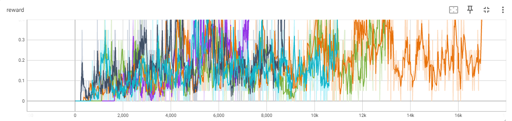
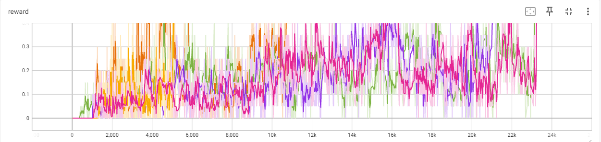
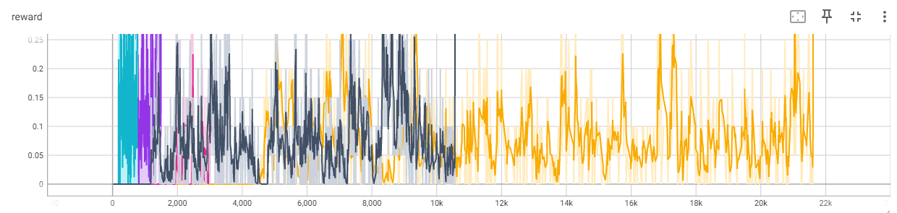

# Отчет 3. Deep Q-learning 

## 1. Изучение алгоритма табличного обучения (tabular Q learning) в среде Frozen Lake (2 балла)
Для алгоритма `Deep Q learning` на поле (4х4) при `alpha=0.2` сходимость достигается в среднем за 12133 итераций (от 7274 до 16992). 
Графики зависимости reward от количества итераций приведены ниже. 

Для алгоритма `Deep Q learning` на поле (4х4) при `alpha=0.05` сходимость достигается в среднем за 14234 итерации (от 5219 до 23249). 
Графики зависимости reward от количества итераций приведены ниже. 

Для алгоритма `Deep Q learning` на поле (4х4) при `alpha=0.9` сходимость достигается в среднем за 11196 итераций (от 776 до 21161). 
Графики зависимости reward от количества итераций приведены ниже. 

**Вывод:** .

## 2. Изучение алгоритма глубокого обучения (Deep Q learning) в среде Pong. (2 балла)

Обучите сеть с гиперпараметрами по умолчанию и запишите видео.

https://github.com/dimson2002/RL/assets/101432345/b0eae97e-1916-4dbd-a38b-264e6043a976

## 3. Исследуйте влияние гиперпараметра (Deep Q learning в среде Pong, на Ваш выбор) на среднее количество шагов обучения. (3 балла)

При обычных параметрах модель обучилась за 1 430 059 шагов. Значительный прирост в скорости дало подключение GPU, 22 f/s против 88 f/s. Скорость увеличилась в 4 раза. (Параметры устройства - процессор Intel Core i5 11-ого поколения, видеокарта - GeForce RTX 3060)

Для исследования я выбрал параметр `gamma`. Этот параметр указывает какую долю будущих вознаграждений мы учитываем при вычислении ожидаемых суммарных вознаграждений. Я выбрал значения 0.6 и 0.2. Чем меньше параметр, тем дольше идет обучение.

