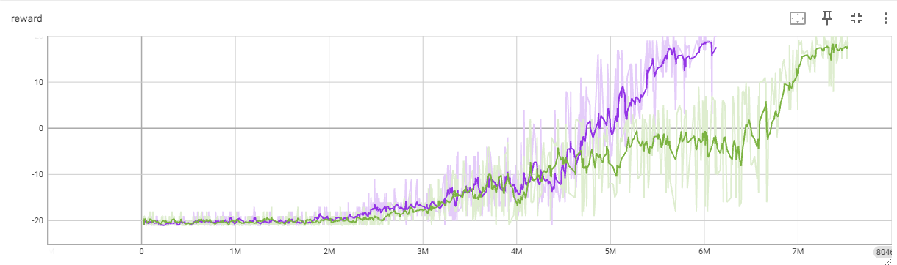

# Отчет 4. REINFORCE and Actor-Critic methods.

## 1. Изучение модификации алгоритма глубокого обучения (Deep Q learning) в среде Cartpole.

Для алгоритма `Deep Q learning` в среде cartpole при стандартных значениях сходимость достигается в среднем за 35 319 итераций (от 20 200 до 50 438). 
Графики зависимости reward от количества итераций приведены ниже.

## 2. Изучение алгоритма REINFORCE. 

Для алгоритма `REINFORCE` при `GAMMA=0.99` сходимость достигается в среднем за 34 053 итераций (от 22 116 до 45 989). 
Графики зависимости reward от количества итераций приведены ниже.

Для алгоритма `REINFORCE` при `GAMMA=0.8` сходимость достигается в среднем за 163 692 итераций (от 48 753 до 278 631). 
Графики зависимости reward от количества итераций приведены ниже.

При изменении параметра в меньшую сторону алгоритм увеличивает количество итераций.

## 3. Изучение алгоритма Actor-Critic. 

Для алгоритма `Actor-Critic` при `NUM_ENVS=50` сходимость достигается в среднем за 7 466 403 итераций (от 6 886 624 до 8 046 182). 
Графики зависимости reward от количества итераций приведены ниже.

Для алгоритма `Actor-Critic` при `NUM_ENVS=30` сходимость достигается в среднем за 6 831 279 итераций (от 6 130 023 до 7 532 534). 
Графики зависимости reward от количества итераций приведены ниже.

Уменьшение этого параметра уменшает количество итераций.
