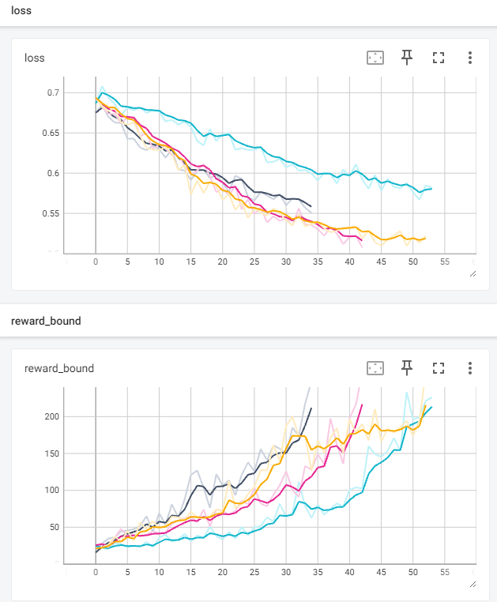
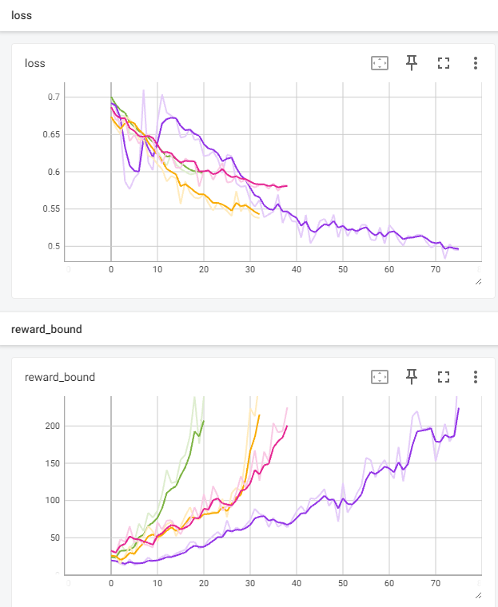
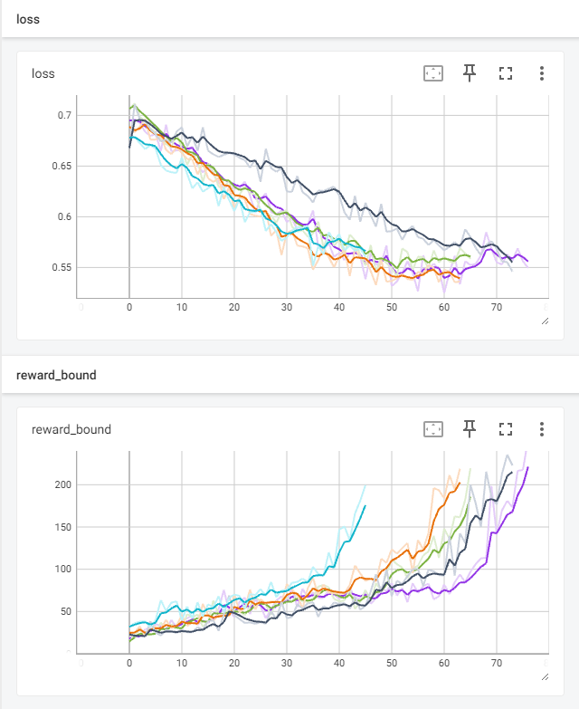
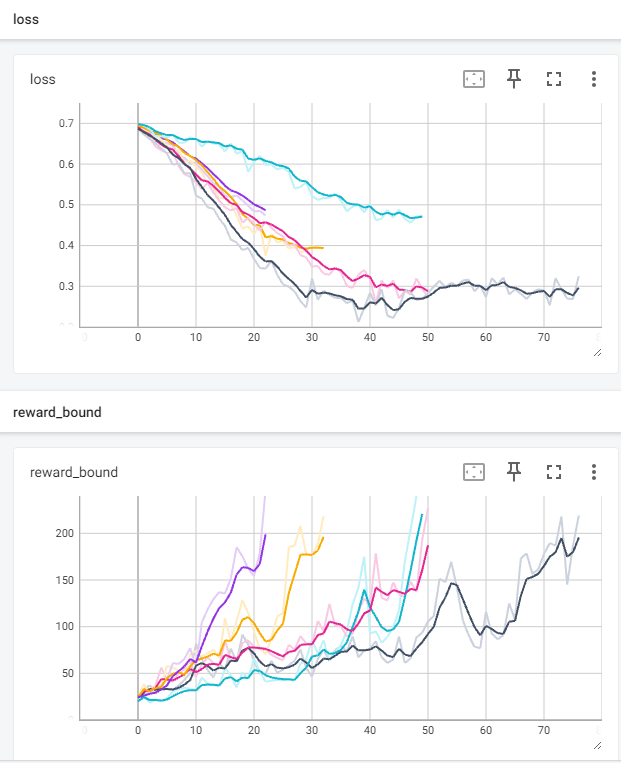
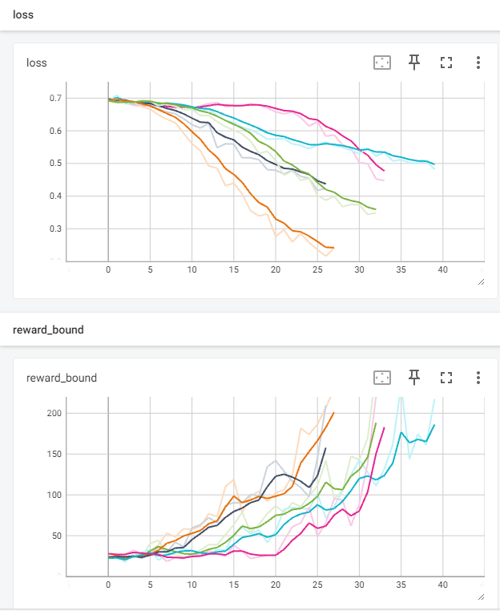

# Отчет 1. Исследование метода кросс-энтропии в среде Cartpole 

## 1. Число скрытых нейронов (2 балла)
При начальном значении `hidden_state=64` сходимость достигается в среднем за 43 итерации (от 34 до 52). 
Графики функции потерь и среднего вознаграждения приведены ниже. 



При увеличении значения `hidden_state=128` сходимость достигается в среднем за 48 итераций (от 20 до 75). 
Можно сделать вывод, что увеличение числа скрытых нейронов отрицательно влияет на скорость сходимости агента. 
Графики функции потерь и среднего вознаграждения приведены ниже. 



При уменьшении значения `hidden_state=32` сходимость достигается в среднем за 61 итерацию (от 45 до 76). 
Можно сделать вывод, что уменьшение числа скрытых нейронов также отрицательно влияет на скорость сходимости агента. 
Графики функции потерь и среднего вознаграждения приведены ниже. 



## 2. Архитектура нейросети (3 балла)
Начальная архитектура имеет следующий вид: 
```
nn.Linear(obs_size, hidden_size),
nn.ReLU(),
nn.Linear(hidden_size, n_actions)
```
Значение `hidden_size=64`. 
Для этой архитектуры сходимость достигается в среднем за 43 итераций (от 34 до 52). 
Можно сделать вывод, что увеличение числа скрытых нейронов не влияет на скорость сходимости агента. 
Графики функции потерь и среднего вознаграждения приведены ниже. 


Начальная архитектура имеет следующий вид: 
```
nn.Linear(obs_size, hidden_size),
nn.ReLU(),
nn.Linear(hidden_size, hidden_size),
nn.ReLU(),
nn.Linear(hidden_size, n_actions)
```
Значение `hidden_size=64`. 
Для этой архитектуры сходимость достигается в среднем за 49 итерации (от 22 до 76). 
Можно сделать вывод, что увеличение слоев сети на 1 отрицательно влияет на сходимость.
Графики функции потерь и среднего вознаграждения приведены ниже. 



Начальная архитектура имеет следующий вид: 
```
nn.Linear(obs_size, hidden_size),
nn.ReLU(),
nn.Linear(hidden_size, hidden_size)
nn.ReLU(),
nn.Linear(hidden_size, hidden_size)
nn.ReLU(),
nn.Linear(hidden_size, n_actions)
```
Значение `hidden_size=64`. 
Для этой архитектуры сходимость достигается в среднем за 33 итерации (от 26 до 39). 
Можно сделать вывод, что увеличение слоев сети на 2 положительно влияет на сходимость.
Графики функции потерь и среднего вознаграждения приведены ниже. 



## 3. Видео отчет (2 балла)
Лучший результат показала архитектура, которая имеет следующий вид: 
```
nn.Linear(obs_size, hidden_size),
nn.ReLU(),
nn.Linear(hidden_size, hidden_size)
nn.ReLU(),
nn.Linear(hidden_size, hidden_size)
nn.ReLU(),
nn.Linear(hidden_size, n_actions)
```
Значение `hidden_size=64`. 
Для этой архитектуры сходимость достигается в среднем за 33 итераций (от 26 до 39). 
# Видео с примером работы агента приведено ниже.  

# <video src="video/rl-video-episode-0.mp4" width="240"/>
