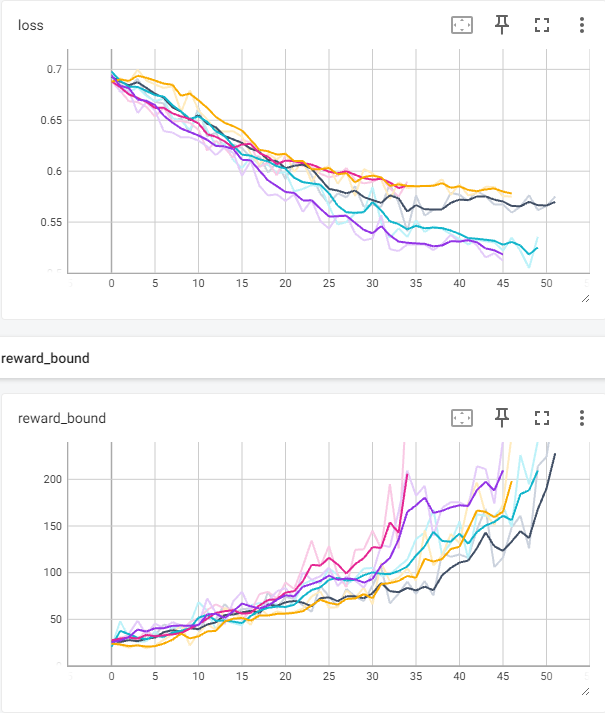
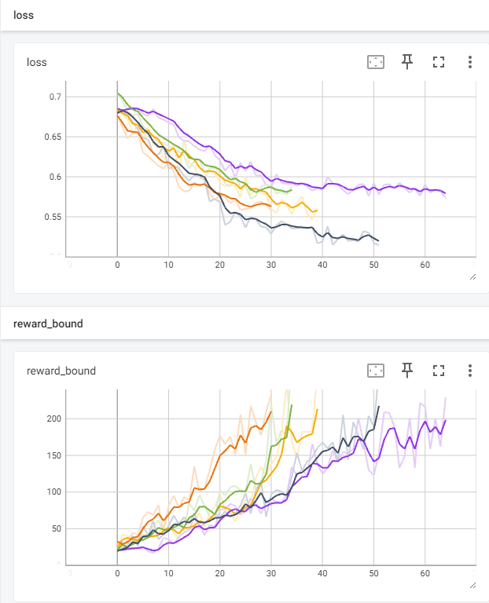
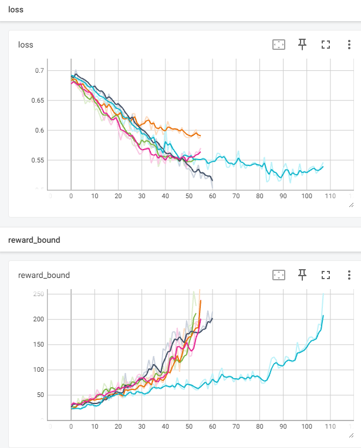
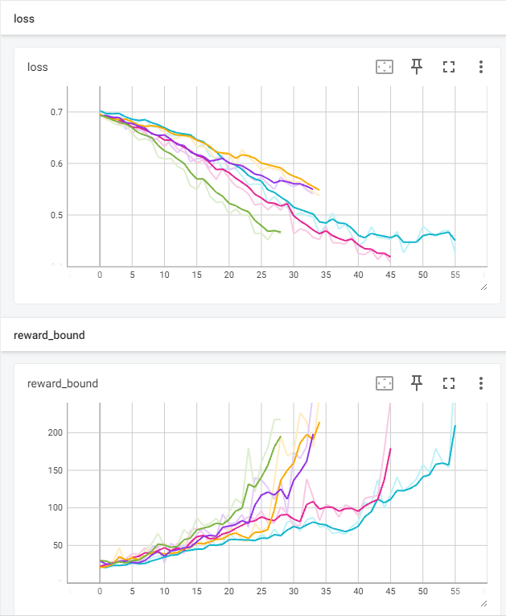
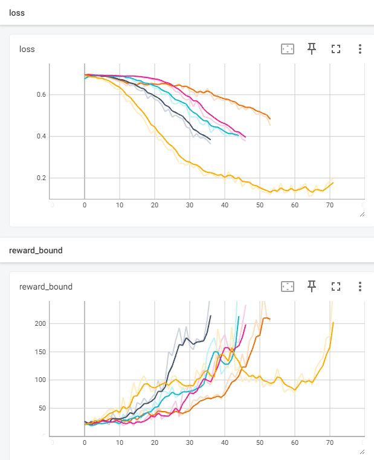

# Отчет 1. Исследование метода кросс-энтропии в среде Cartpole 

## 1. Число скрытых нейронов (2 балла)
При начальном значении `hidden_state=64` сходимость достигается в среднем за 57 итераций (от 44 до 67). 
Графики функции потерь и среднего вознаграждения приведены ниже. 



При увеличении значения `hidden_state=128` сходимость достигается в среднем за 57 итераций (от 44 до 67). 
Можно сделать вывод, что увеличение числа скрытых нейронов не влияет на скорость сходимости агента. 
Графики функции потерь и среднего вознаграждения приведены ниже. 



При уменьшении значения `hidden_state=32` сходимость достигается в среднем за 57 итераций (от 44 до 67). 
Можно сделать вывод, что уменьшение числа скрытых нейронов не влияет на скорость сходимости агента. 
Графики функции потерь и среднего вознаграждения приведены ниже. 



## 2. Архитектура нейросети (3 балла)
Начальная архитектура имеет следующий вид: 
```
nn.Linear(obs_size, hidden_size),
nn.ReLU(),
nn.Linear(hidden_size, n_actions)
```
Значение `hidden_size=64`. 
Для этой архитектуры сходимость достигается в среднем за 57 итераций (от 44 до 67). 
Можно сделать вывод, что увеличение числа скрытых нейронов не влияет на скорость сходимости агента. 
Графики функции потерь и среднего вознаграждения приведены ниже. 


Начальная архитектура имеет следующий вид: 
```
nn.Linear(obs_size, hidden_size),
nn.ReLU(),
nn.Linear(hidden_size, hidden_size/2)
nn.ReLU(),
nn.Linear(hidden_size/2, n_actions)
```
Значение `hidden_size=64`. 
Для этой архитектуры сходимость достигается в среднем за 42 итерации (от 28 до 55). 
Можно сделать вывод, что увеличение слоев сети на 1 положительно влияет на сходимость.
Графики функции потерь и среднего вознаграждения приведены ниже. 



Начальная архитектура имеет следующий вид: 
```
nn.Linear(obs_size, hidden_size),
nn.ReLU(),
nn.Linear(hidden_size, hidden_size/2)
nn.ReLU(),
nn.Linear(hidden_size/2, hidden_size/4)
nn.ReLU(),
nn.Linear(hidden_size/4, n_actions)
```
Значение `hidden_size=64`. 
Для этой архитектуры сходимость достигается в среднем за 62 итерации (от 53 до 71). 
Можно сделать вывод, что увеличение слоев сети на 2 отрицательно влияет на сходимость.
Графики функции потерь и среднего вознаграждения приведены ниже. 



## 3. Видео отчет (2 балла)
Лучший результат показала архитектура, которая имеет следующий вид: 
```
nn.Linear(obs_size, hidden_size),
nn.ReLU(),
nn.Linear(hidden_size, n_actions)
```
Значение `hidden_size=64`. 
Для этой архитектуры сходимость достигается в среднем за 57 итераций (от 44 до 67). 
Видео с примером работы агента приведено ниже.  

<video src="video/rl-video-episode-0.mp4" width="240"/>
